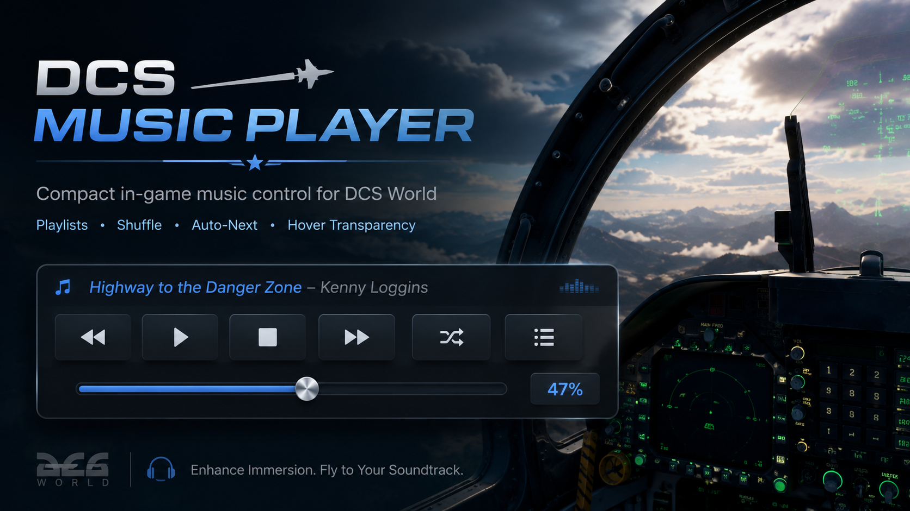
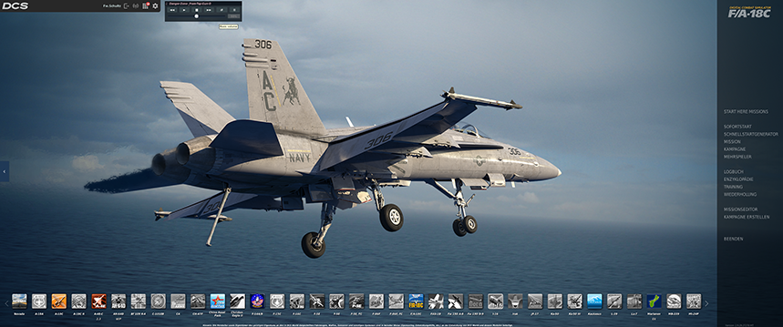
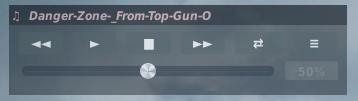

<div align="center">

  

  <h1>DCS Music Player</h1>

  <p>Ein kompakter In-Game-Musikplayer für DCS World – eigene Musik hören und steuern, ohne das Spiel verlassen zu müssen.</p>

<p>
  <a href="https://github.com/FwSchultz/DCS-Music-Player/releases">
    
  </a>
  <a href="https://github.com/FwSchultz/DCS-Music-Player/commits/main">
    
  </a>
  <a href="https://github.com/FwSchultz/DCS-Music-Player/stargazers">
    
  </a>
  <a href="https://github.com/FwSchultz/DCS-Music-Player/issues">
    
  </a>
  
  
</p>

<h4>
  <a href="#installation">Installation</a>
  <span> · </span>
  <a href="https://github.com/FwSchultz/DCS-Music-Player/issues">Fehler melden</a>
  <span> · </span>
  <a href="https://github.com/FwSchultz/DCS-Music-Player/issues">Feature vorschlagen</a>
</h4>
</div>

<br />

# Inhaltsverzeichnis

- [Über das Projekt](#über-das-projekt)
- [Funktionen](#funktionen)
- [Screenshots](#screenshots)
- [Technik](#technik)
- [Projektstruktur](#projektstruktur)
- [Voraussetzungen](#voraussetzungen)
- [Installation](#installation)
- [Musik und Playlists](#musik-und-playlists)
- [Bedienung](#bedienung)
- [Automatischer Titelwechsel](#automatischer-titelwechsel)
- [Transparenz](#transparenz)
- [Konfiguration](#konfiguration)
- [Logdatei und Fehleranalyse](#logdatei-und-fehleranalyse)
- [Update](#update)
- [Hotkeys](#hotkeys)
- [Hinweise und bekannte Einschränkungen](#hinweise-und-bekannte-einschränkungen)
- [Credits](#credits)
- [Lizenz](#lizenz)

---

## Über das Projekt

**DCS Music Player** ist ein leichter Musikplayer, der direkt in der Benutzeroberfläche von **DCS World** läuft. Dadurch lässt sich eigene Musik während des Fliegens bedienen, ohne DCS verlassen oder eine zusätzliche Anwendung in den Vordergrund holen zu müssen.

Das Projekt wurde vom ursprünglichen **DCS-Walkman von Bailey** inspiriert und anschließend mit einer eigenen Implementierung neu aufgebaut und erweitert. Dazu gehören unter anderem ein neues kompaktes Interface, mehrere Playlists, automatischer Titelwechsel, Shuffle, gespeicherte Lautstärke und konfigurierbare Hover-Transparenz.

Der Player wird ausschließlich im **Saved-Games-Verzeichnis** von DCS installiert. Dateien der eigentlichen DCS-Installation werden nicht verändert.

---

## Funktionen

- Kompakter In-Game-Musikplayer
- Läuft direkt innerhalb von DCS World
- Unterstützung für **OGG** und **WAV**
- Mehrere Playlists über Unterordner
- Automatischer Wechsel zum nächsten Titel
- Previous / Play / Stop / Next
- Shuffle-Funktion
- Playlist-Auswahl direkt im Player
- Lautstärkeregler im Spiel
- Gewählte Lautstärke wird gespeichert
- Aktueller Titel in der Fensterleiste
- Lauftext für lange Dateinamen
- Frei verschiebbares Player-Fenster
- Kompaktes **328-px-Layout**
- Automatische Hover-Transparenz
- Inaktive und aktive Transparenz konfigurierbar
- Musik kann ohne Neubau oder Neuinstallation ergänzt werden
- Keine externe Anwendung erforderlich
- Installation in `Saved Games` und damit updatefreundlich
- Eigene Logdatei zur Fehleranalyse

---

## Screenshots

<p align="center">
  
</p>

### Im DCS-Hauptmenü

<p align="center">
  
</p>

### Kompakte Player-Ansicht

<p align="center">
  
</p>

---

## Technik

- **Sprache:** Lua
- **Umgebung:** DCS GUI / Saved Games Hook
- **DCS-Version:** DCS World 2.9+
- **Audio:** OGG und WAV
- **Installation:** ausschließlich `Saved Games`
- **Zusätzliche Software:** nicht erforderlich
- **Konfiguration:** automatisch erzeugte `config.lua`
- **Plattform:** Windows / DCS World

---

## Projektstruktur

```text
DCS-Music-Player/
├── Config/
│   └── DCS-Music-Player/
│       └── Music/
│           ├── Metal/
│           ├── Rock/
│           ├── Soundtracks/
│           ├── Top Gun/
│           └── Vietnam/
├── Scripts/
│   ├── DCS-Music-Player/
│   │   └── PlayerWindow.dlg
│   └── Hooks/
│       └── dcs-music-player-hook.lua
├── docs/
│   └── images/
├── .gitignore
└── README.md
```

Die mitgelieferten Playlist-Ordner enthalten lediglich Platzhalter. **Es werden keine Musikdateien mit diesem Repository verteilt.**

---

## Voraussetzungen

- Installiertes **DCS World 2.9 oder neuer**
- Zugriff auf das eigene DCS-`Saved Games`-Verzeichnis
- Eigene Musikdateien im Format `.ogg` oder `.wav`

Der Player benötigt keine zusätzliche EXE, keinen separaten Musikplayer und keinen Hintergrunddienst.

---

## Installation

### 1. DCS Music Player herunterladen

Lade die aktuelle Version über die GitHub-Releases herunter und entpacke das ZIP-Archiv.

### 2. Dateien kopieren

Kopiere die enthaltenen Ordner `Config` und `Scripts` in dein DCS-`Saved Games`-Verzeichnis.

Beispiel für DCS:

```text
C:\Users\DEINNAME\Saved Games\DCS\
```

Je nach Installation kann dein Ordner auch beispielsweise so heißen:

```text
C:\Users\DEINNAME\Saved Games\DCS.openbeta\
```

Danach müssen insbesondere diese Dateien vorhanden sein:

```text
Saved Games\DCS\Scripts\Hooks\dcs-music-player-hook.lua
Saved Games\DCS\Scripts\DCS-Music-Player\PlayerWindow.dlg
```

### 3. DCS starten

Starte DCS World. Der Music Player wird automatisch geladen.

Beim ersten Start legt der Player seine Konfiguration selbst an:

```text
Saved Games\DCS\Config\DCS-Music-Player\config.lua
```

---

## Musik und Playlists

Eigene Musik wird hier abgelegt:

```text
Saved Games\DCS\Config\DCS-Music-Player\Music\
```

Unterstützte Formate:

```text
.ogg
.wav
```

Musik kann direkt im `Music`-Ordner liegen. Für mehrere Playlists werden Unterordner verwendet.

Beispiel:

```text
Music\
├── Rock\
│   ├── song1.ogg
│   └── song2.ogg
├── Metal\
│   ├── song1.ogg
│   └── song2.ogg
├── Soundtracks\
│   └── song1.ogg
└── Vietnam\
    └── song1.ogg
```

Jeder direkte Unterordner wird automatisch als eigene Playlist erkannt. Leere Playlist-Ordner werden ignoriert.

> **Wichtig:** Musikdateien gehören nicht in das GitHub-Repository. Die `.gitignore` blockiert gängige Audioformate vorsorglich.

---

## Bedienung

| Symbol | Funktion |
|---|---|
| `◄◄` | Vorheriger Titel |
| `►` | Aktuellen Titel abspielen |
| `■` | Wiedergabe stoppen |
| `►►` | Nächster Titel |
| `⇄` | Shuffle |
| `≡` | Playlist-Menü |

Der Regler unterhalb der Buttons steuert die Musiklautstärke.

### Playlist auswählen

Mit `≡` wird die Playlist-Auswahl geöffnet. Nach Auswahl einer Playlist schließt sich das Menü automatisch.

Die Musikordner werden beim Start von DCS eingelesen.

---

## Automatischer Titelwechsel

DCS Music Player ermittelt die Spieldauer unterstützter OGG- und WAV-Dateien. Sobald ein Titel beendet ist, startet automatisch der nächste Titel der aktuellen Playlist.

Dadurch können Playlists ohne manuellen Eingriff durchlaufen.

---

## Transparenz

Der Player soll während des Fliegens möglichst wenig verdecken.

Standardmäßig gilt:

```text
Maus außerhalb des Players: 25 % Deckkraft
Maus über dem Player:       100 % Deckkraft
```

Die Werte können in der automatisch erzeugten Konfiguration angepasst werden:

```text
Saved Games\DCS\Config\DCS-Music-Player\config.lua
```

Standard:

```lua
inactiveOpacity = 0.25,
hoverOpacity = 1.00,
```

Weitere Beispiele:

```lua
inactiveOpacity = 0.40,
hoverOpacity = 1.00,
```

oder:

```lua
inactiveOpacity = 0.20,
hoverOpacity = 0.85,
```

Der unterstützte Bereich liegt ungefähr zwischen:

```text
0.05 = 5 %
1.00 = 100 %
```

---

## Konfiguration

Die Konfigurationsdatei wird automatisch erzeugt:

```text
Saved Games\DCS\Config\DCS-Music-Player\config.lua
```

Gespeichert werden unter anderem:

- Lautstärke
- Fensterposition
- Fenstergröße
- ausgewählte Playlist
- inaktive Deckkraft
- Hover-Deckkraft
- Auto-Next-Einstellungen
- Hotkey-Belegung

Die meisten Nutzer müssen diese Datei nicht manuell bearbeiten.

---

## Logdatei und Fehleranalyse

Der Player schreibt eine eigene Logdatei:

```text
Saved Games\DCS\Logs\DCS-Music-Player.log
```

Bei Problemen sollte diese Datei zusammen mit einer kurzen Fehlerbeschreibung bereitgestellt werden.

Fehler und Verbesserungsvorschläge können über die GitHub-Issues gemeldet werden:

https://github.com/FwSchultz/DCS-Music-Player/issues

---

## Update

Bei einem Update müssen normalerweise nur diese Dateien ersetzt werden:

```text
Saved Games\DCS\Scripts\Hooks\dcs-music-player-hook.lua
Saved Games\DCS\Scripts\DCS-Music-Player\PlayerWindow.dlg
```

Eigene Musik und die vorhandene `config.lua` können bestehen bleiben.

Vor einem größeren Versionssprung empfiehlt sich trotzdem eine Sicherung der Konfigurationsdatei.

---

## Hotkeys

Die aktuelle Version enthält bereits eine Hotkey-Konfiguration. Die Standardbelegung ist:

| Aktion | Hotkey |
|---|---|
| Player ein-/ausblenden | `Ctrl + Shift + 8` |
| Stop | `Ctrl + Shift + 1` |
| Vorheriger Titel | `Ctrl + Shift + 2` |
| Play | `Ctrl + Shift + 3` |
| Nächster Titel | `Ctrl + Shift + 4` |
| Shuffle | `Ctrl + Shift + 5` |
| Lautstärke leiser | `Ctrl + Shift + 6` |
| Lautstärke lauter | `Ctrl + Shift + 7` |
| Musik neu einlesen | `Ctrl + Shift + 9` |
| Vorherige Playlist | `Ctrl + Shift + 0` |
| Nächste Playlist | `Ctrl + Shift + -` |

Die Werte sind in der `config.lua` hinterlegt.

---

## Hinweise und bekannte Einschränkungen

- Der Player läuft innerhalb der DCS-GUI-Umgebung.
- Unterstützt werden aktuell OGG und WAV.
- Das Projekt ist primär für Flatscreen-Nutzung ausgelegt; VR-Kompatibilität kann abweichen.
- Falls der ursprüngliche DCS-Walkman oder ein anderer Music-Player-Hook installiert ist, sollte dessen Hook deaktiviert werden, um Konflikte zu vermeiden.
- **Integrity Check Safe wird derzeit nicht zugesichert**, solange der Player nicht auf einem IC-geschützten Multiplayer-Server entsprechend getestet wurde.

---

## Credits

Besonderer Dank geht an **Bailey**, den Entwickler des ursprünglichen **DCS-Walkman**. Sein Projekt war Inspiration und Ausgangspunkt für diesen Community-Musikplayer.

Original DCS-Walkman von Bailey:

https://files.digitalcombatsimulator.com/en/files/3322875/

DCS Music Player wurde anschließend eigenständig neu aufgebaut und unter anderem um ein neues Interface, Playlist-Verwaltung, automatischen Titelwechsel, Lauftext, konfigurierbare Hover-Transparenz und weitere Funktionen erweitert.

Vielen Dank an Bailey für die ursprüngliche Idee und seinen Beitrag zur DCS-Community.

---

## Lizenz

Für dieses Repository ist derzeit noch keine Lizenzdatei festgelegt. Bis eine Lizenz ergänzt wurde, gelten die üblichen urheberrechtlichen Bestimmungen des Repository-Inhabers.
